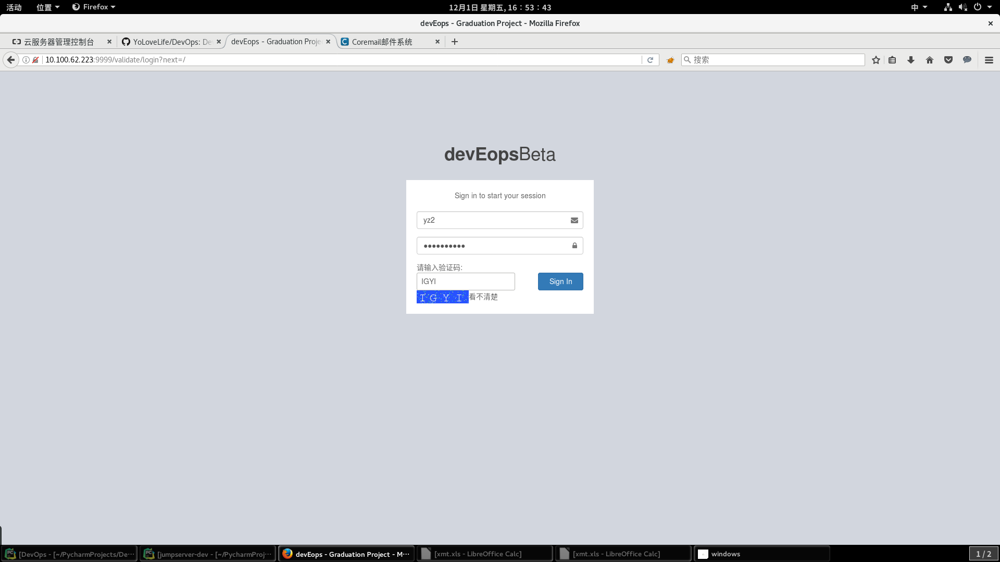
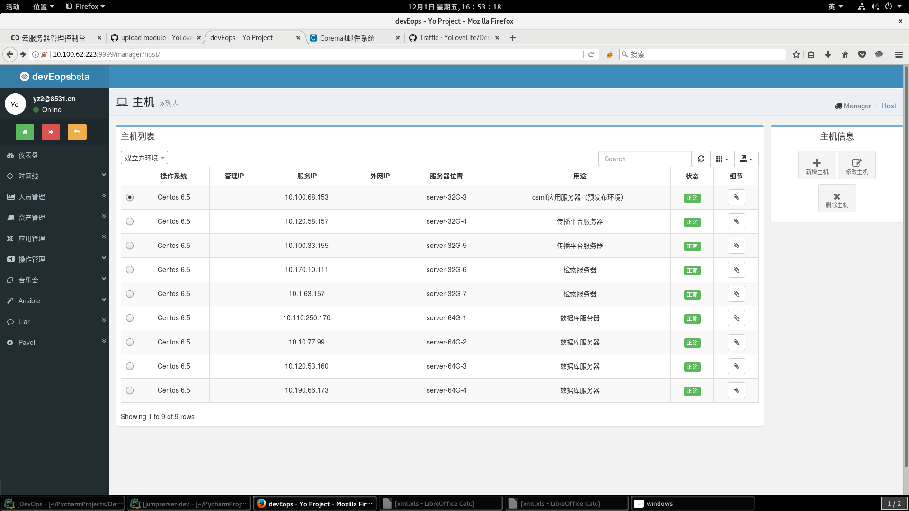

devEops :laughing: 开发自运维平台
================================
[](https://travis-ci.org/YoLoveLife/devEops)
[](https://github.com/YoLoveLife/devEops/releases)
[](./LICENSE.md) :yum: </br>

Author: [YoLoveLife.com](http://www.yolovelife.com) :ok_hand: </br>

运维体系解决方案</br>
:muscle: 已经努力让它适用于各种可能出现的生产环境</br>
django & rest-framework & bootstrap</br>
:muscle: 参考了诸多django项目 我的Django用的真的很棒</br>
travis & django TestCase</br>
:muscle: 单元测试 测试不规范但是努力去做

如果你关注：自动化运维、运维资源管理等内容  :star: 我,[分享](http://www.yolovelife.com)给其他的运维人员</br>
如果你关注：django开发、rest-framework等内容  :star: 我,[分享](http://www.yolovelife.com)给其他的开发者</br>
求求你们 :star: 我吧!!!   求求你们 :star: 我吧!!!   求求你们 :star: 我吧!!!</br>

*关于我开发中遇到的问题 我会写在issues当中供有需要的朋友 :mag: 查询*</br>
*这些问题都是在查询了诸多资料并亲身尝试大量解决方案 :grimacing: 最后得出的结论*</br>
*您可以在issues中搜索**helper**查看我写的相关问题 我写的很用心*</br>
*如果未找到您关注的问题或者您对我的项目有建议请在issues和我讨论 :heart: 期待收到您的信息*</br>

## Contents
* [介绍](#introduce)
* [平台一览](#looklike)
* [如何安装](#howtoinstall)
* [自运维功能实现](#whatcando)
## <a name="introduce"> 介绍 </a>
本开发自运维平台致力于IT资源信息的整合与自动化运维，通过服务、应用配置的信息整合来运维提供帮助。</br>

- 所有运维操作都基于信息整合的正确性和一致性(资产信息管理) :floppy_disk: </br>
- :bar_chart: 提供资产信息的统计,应用系统的占比、脚本|剧本的调用次数等</br>
- 可临时搜集应用上的信息(如MySQL的status等信息)</br>
- 所有运维操作(脚本 | 剧本)在提交的时候会自动注入资产信息并通过ansible远程执行</br>
- 所有资产信息、架构信息都存储在数据库中供所有运维人员操作</br>
- 开发人员可登陆平台提交工单发起防火墙修改、应用发布、日常运维 :clock9: 等操作,运维人员许可操作进行</br>
- 所有应用发布、日常运维工作日程展示 :date: </br>
- 详细权限操作，区分开发人员以及运维人员 </br>

## <a name="looklike"> 平台一览 </a>
### 登陆界面
</br>
### 主机管理
</br>
### 脚本编写
</br>
### 时间线展示
</br>

## <a name="howtoinstall"> 如何安装 </a>
devEops依赖于python2.7、诸多python第三方模块以及mysql数据库</br>
以下操作环境已经拥有python2.7以及mysql数据库
```bash
$ cd path/to/project/folder/

#安装python第三方库
$ pip install -r requirements.txt

#连接本地数据库并创建数据表结构
$ vim apps/deveops/settings.py #DATABASES中输入数据库连接方法
$ python apps/manage.py makemigrations
$ python apps/manage.py migrate

#启动服务
$ python apps/manage.py runserver &
#默认启动在8000端口 你可能需要一个nginx做Web服务器
```
## <a name="whatcando"> 自运维功能实现 </a>
